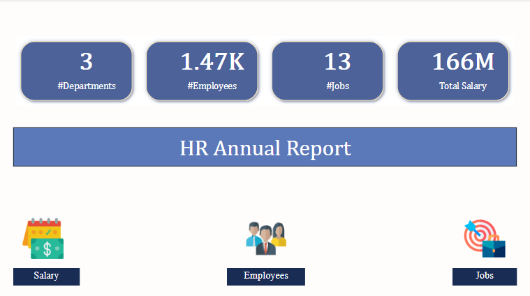
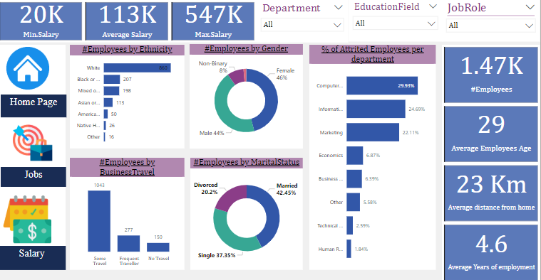
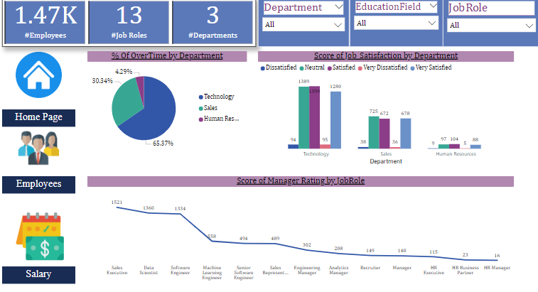
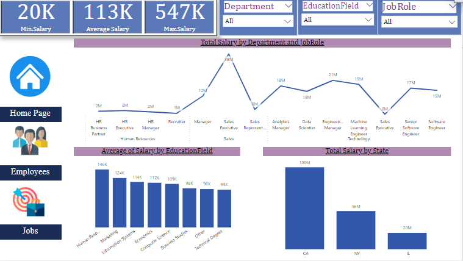

# 🛠️ **HR Data Analysis Dashboard**  

## 📊 **Project Overview**  
This project delivers an interactive **HR Data Analysis Dashboard** built in **Power BI**. It provides comprehensive insights into employee data, job details, salaries, and more, enabling data-driven decision-making.  

---

## 🌟 **Features**  
- **🏠 Home Page:** Overview of key HR metrics.  
- **👩‍💼 Employees:** Detailed employee profiles and demographics.  
- **💼 Jobs:** Insights into roles and responsibilities across the organization.  
- **💰 Salaries:** Comprehensive salary distribution analysis.  
- **📋 Data Table:** Raw data for further exploration.  

---

## 🖼️ **Dashboard Preview**  

### **🏠 Home Page**  
  

### **👩‍💼 Employees View**  
  

### **💼 Jobs View**  
  

### **💰 Salary View**  
  

---

## 🚀 **Getting Started**  

### **Prerequisites**  
- [Power BI Desktop](https://powerbi.microsoft.com/desktop/) (latest version)  
- HR dataset (provided in the repository).  

